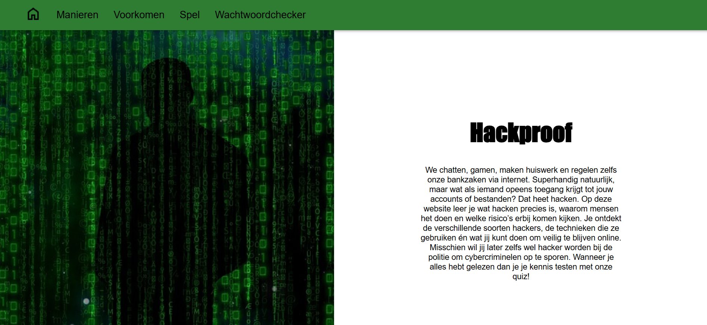

# Hack-yeah-

## 1. Over het product

**Hackproof** is een interactieve en educatieve website gericht op brugklasleerlingen (11 t/m 13 jaar). Het doel van onze website is om jongeren bewust te maken van internetveiligheid en de gevaren van hacken.

We willen leerlingen leren:
- Wat hacken is 
- Hoe cybercriminelen te werk gaan
- Welke stappen men kan nemen om gehackt te worden te voorkomen

De website bevat interactieve en informatieve onderdelen die aansluiten bij de leefwereld van brugklassers. Zo dragen we bij aan een veiligere online wereld.
(De interactieve delen zijn gemaakt met Python)

De homepagina:

---

## 2. Hoe het product uitgevoerd kan worden

De website is live te bekijken via GitHub Pages:

https://dayajansen.github.io/Hack-yeah-/index.html   

Zorg voor een internetverbinding zodat de onderdelen die we met Python via PyScript hebben geschreven, correct worden geladen.

---

## 3. Domeinen voor beoordeling

Wij willen beoordeeld worden op de volgende domeinen:
1. Website
2. Programmeren
3. Maatschappelijke invloed

De website is te zien via de hierboven gegeven link. De programmeercode en het geschreven stuk voor het 3e domein zijn ingeleverd via de Q-highschool site.

---

## 4. Benodigde informatie voor het uitvoeren van het programmeer-deel.

### Benodigde software

De Python-onderdelen zijn verwerkt in onze website met behulp van PyScript. De website draait via GitHub Pages. Voor het testen van onze website is dan ook geen installatie van software nodig, omdat het allemaal in de browser wordt uitgevoerd.
De enige benodigdheden zijn: een moderne webbrowser (Chrome, Firefox of Edge) en een werkende internetverbinding (zodat PyScript geladen kan worden).

### De Python-onderdelen

Onze website bevat twee Python-elementen:

#### Wachtwoordchecker

De gebruiker kan een wachtwoord invoeren, waarna met Python gecontroleerd wordt of het wachtwoord veilig genoeg is op basis van lengte, gebruik van cijfers, hoofdletters en speciale tekens. Het resultaat verschijnt direct op de pagina.

Hoe te testen:
1. Ga naar de website via de link hierboven.
2. Klik in het menu op 'Wachtwoordchecker'.
3. Voer een wachtwoord in en klik op de knop 'Check'.
4. Bekijk de beoordeling van het wachtwoord.

#### Phishing-Detector Spel

De gebruiker krijgt een aantal voorbeelden van e-mails en moet aangeven of ze echt of phishing zijn. Het programma geeft feedback (juist/onjuist) en houdt de score bij.

Hoe te testen:
1. Ga naar de website en klik in het menu op 'Spel'.
2. Klik op 'Start' om met het spel te beginnen.
3. Beantwoord de vragen door op de juiste knoppen te klikken.
4. Na elk antwoord geeft Python feedback en houdt de score bij.

### Hoe werkt het technisch

- De Python-code wordt aangeroepen via de <py-script>-tags in de HTML.
- Deze code wordt uitgevoerd in de browser met behulp van PyScript.